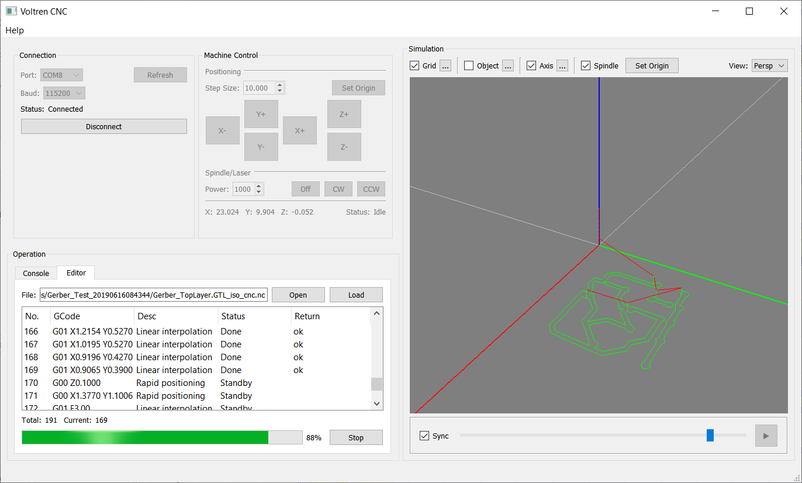

# Velton CNC

Velton CNC is an open-source, cross-platform CNC controller software that lets you load GCode files, edit individual commands, and visualize toolpaths before sending them to a physical CNC machine. It currently supports machines running on GRBL firmware, with the flexibility to extend support to other types of machines in the future.

## Screenshots

